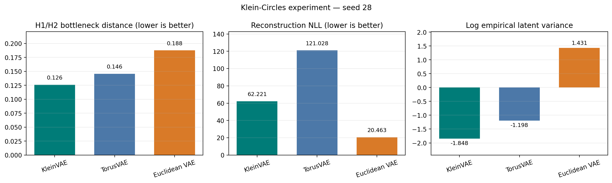
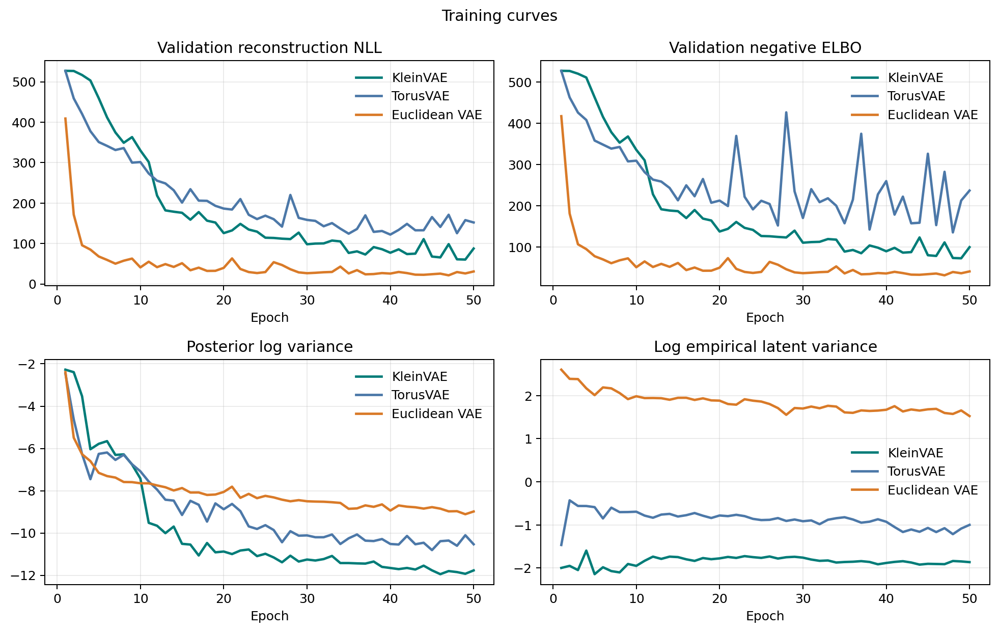

# KleinVAE

Code and experiments for
[*Reparameterization through Coverings and Topological Weight Priors*](https://arxiv.org/abs/2604.23804).

KleinVAE uses a covering map and a topological weight prior to construct a
variational autoencoder with a Klein-bottle latent space. The repository also
contains TorusVAE and Euclidean VAE baselines.

## Notebook

[`notebooks/KleinVAE.ipynb`](notebooks/KleinVAE.ipynb) contains the complete
Klein-Circles experiment:

- deterministic data generation and train/validation/test splitting;
- KleinVAE, TorusVAE, and Euclidean VAE training;
- lowest-validation-loss checkpoint selection;
- reconstruction, negative ELBO, and latent-variance logging;
- quotient-aware persistent-homology evaluation;
- result tables and figures;
- Appendix Figures 5 and 6.

The three models are trained and evaluated with seed 28. No seed sweep is run.

## Results

| Model | Reconstruction NLL | Negative ELBO / bound | H1/H2 bottleneck | Log empirical latent variance |
|---|---:|---:|---:|---:|
| KleinVAE | 62.22 | 76.68 | 0.1261 | -1.8478 |
| TorusVAE | 121.03 | 132.61 | 0.1455 | -1.1975 |
| Euclidean VAE | 20.46 | 31.98 | 0.1876 | 1.4314 |



KleinVAE gives a 32.8% lower intrinsic H1/H2 bottleneck score than the
Euclidean VAE in this run. The Euclidean VAE gives the lower reconstruction
NLL.



## Installation

```bash
uv sync
```

Run the tests with:

```bash
uv run pytest
```

Execute the notebook with the saved results:

```bash
uv run python scripts/run_notebook.py
```

Train all three models and run the complete evaluation:

```bash
KLEINVAE_RUN_TRAINING=1 uv run python scripts/run_notebook.py
```

The training run writes checkpoints and CSV metrics below
`logs/klein_circles_seed28/`. Result tables and figures are written to
`results/klein_circles/`.

## Experiment configuration

[`configs/experiment/klein_circles.yaml`](configs/experiment/klein_circles.yaml)
defines:

- 100,000 binary 30×30 Klein-Circles images with radius 0.3;
- an 80/10/10 train, validation, and test split;
- the same `900 → 1024 → 512 → 128 → 32 → 5` encoder and reversed decoder for
  all models;
- a two-dimensional latent space with full 2×2 posterior covariance;
- Adam with learning rate `1e-3`;
- batch size 1024 and 50 epochs;
- pixel-summed Bernoulli reconstruction NLL;
- KL weight 1.

Hydra stores the resolved configuration and seed for every run. The CSV logger
records the following epoch-level quantities:

| Metric | Definition |
|---|---|
| `recon_nll` | Pixel-summed Bernoulli negative log-likelihood per observation. |
| `kl` | Gaussian KL for Euclidean VAE and cover-space KL bound for KleinVAE/TorusVAE. |
| `negative_elbo` | Posterior reconstruction estimate plus KL. |
| `posterior_log_variance` | Mean `log(diag(Σq(x)))` produced by the encoder. |
| `latent_code_variance` | Sum of coordinate variances of projected posterior samples. |
| `log_latent_code_variance` | Natural logarithm of empirical latent-code variance. |

## Appendix figures

The notebook also generates Figures 5 and 6 from the exported curves in
[`data/appendix`](data/appendix). They can be generated directly with:

```bash
uv run python scripts/plot_appendix.py
```

## Repository structure

```text
configs/experiment/klein_circles.yaml  training configuration
data/appendix/                          exported appendix curves
notebooks/KleinVAE.ipynb               complete experiment notebook
results/klein_circles/                 single-run results and figures
results/appendix/                       appendix figures and metadata
scripts/evaluate_checkpoint.py         checkpoint evaluation
scripts/plot_appendix.py                appendix figure generation
scripts/run_notebook.py                 notebook execution
src/                                    datasets, models, callbacks, and metrics
tests/                                  unit and integration tests
```
